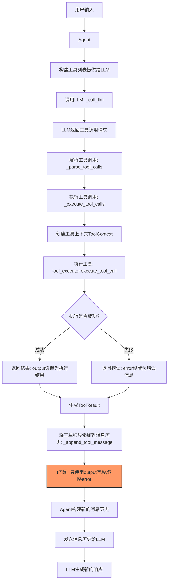
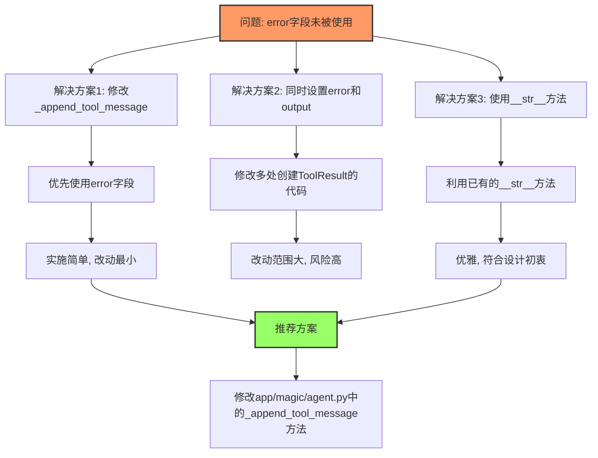

# ToolResult 流程分析

## ToolResult 结构

`ToolResult` 是一个工具执行结果的封装类，定义在 `app/core/entity/tool/tool_result.py` 中，主要字段：

```python
class ToolResult(BaseModel):
    """Represents the result of a tool execution."""

    output: str = Field(default="", description="工具执行的结果，将作为输出返回给大模型")
    error: Optional[str] = Field(default=None)
    system: Optional[str] = Field(default=None)
    tool_call_id: Optional[str] = Field(default=None)
    name: Optional[str] = Field(default=None)
    execution_time: float = Field(default=0.0, description="工具执行耗时（秒）")
    explanation: Optional[str] = Field(default=None, description="大模型执行此工具的意图解释")
```

主要字段说明：
- `output`: 工具执行的结果，会被作为输出返回给大模型
- `error`: 错误信息，如果有错误，该字段不为 None
- `tool_call_id`: 工具调用ID，用于关联工具调用和结果
- `name`: 工具名称

## 工具调用链路

整个工具调用链路如下：

1. LLM 生成工具调用 (app/magic/agent.py 中的 `_call_llm` 方法)
2. Agent 解析工具调用 (app/magic/agent.py 中的 `_parse_tool_calls` 方法)
3. Agent 执行工具调用 (app/magic/agent.py 中的 `_execute_tool_calls` 方法)
4. 工具执行器执行工具 (app/tools/core/tool_executor.py 中的 `execute_tool_call` 方法)
5. 工具结果 (ToolResult) 生成
6. 将工具结果添加到 Agent 的消息历史 (app/magic/agent.py 中的 `_append_tool_message` 方法)
7. 将消息历史发送给 LLM

### 流程图



## 主要流程分析

### 1. 工具调用生成

在 app/magic/agent.py 的 `_call_llm` 方法中，将工具列表转换为 LLM 需要的格式，然后调用 LLM 生成工具调用。

```python
# 将工具实例转换为LLM需要的格式
tools_list = []
if self.tools:
    for tool_name in self.tools.keys():
        tool_instance: BaseTool = tool_factory.get_tool_instance(tool_name)
        tool_param = tool_instance.to_param()
        tools_list.append(tool_param)

# 使用 LLMFactory.call_with_tool_support 方法统一处理工具调用
llm_response: ChatCompletion = await LLMFactory.call_with_tool_support(
    self.llm_model_id,
    messages,
    tools=tools_list if tools_list else None,
    stop=self.agent_context.stop_sequences if hasattr(self.agent_context, 'stop_sequences') else None
)
```

### 2. 工具调用执行

当 LLM 返回工具调用后，在 app/magic/agent.py 的 `_execute_tool_calls` 方法中执行工具调用。

```python
async def _execute_tool_calls(self, tool_calls: List[ChatCompletionMessageToolCall], llm_response_message: ChatCompletion) -> List[ToolResult]:
    """执行 Tools 调用"""
    results = []
    for tool_call in tool_calls:
        try:
            tool_name = tool_call.function.name
            tool_arguments = tool_call.function.arguments

            # 解析工具参数...

            # 创建工具上下文
            tool_context = ToolContext(
                agent_context=self.agent_context,
                tool_call_id=tool_call.id,
                tool_name=tool_name,
                arguments=tool_arguments
            )

            # 执行工具调用
            result = await tool_executor.execute_tool_call(tool_context=tool_context, arguments=tool_arguments)

            # 触发 after_tool_call 事件...

        except Exception as e:
            # 处理异常...
            result = ToolResult(
                output=friendly_error,
                error=friendly_error,
                tool_call_id=tool_call.id
            )

        results.append(result)

    return results
```

### 3. 工具结果添加到消息历史

在 app/magic/agent.py 的 `_append_tool_message` 方法中将工具结果添加到消息历史。

```python
def _append_tool_message(self, message: ToolResult, is_internal: bool = False) -> None:
    """追加 tool 消息"""
    # 如果没有tool_call_id，则抛出异常，避免污染chat_history
    if message.tool_call_id is None:
        error_msg = f"无法追加工具消息：缺少tool_call_id。消息内容: {message.output}"
        logger.error(error_msg)
        raise ValueError(error_msg)

    # 确保工具输出内容不为空
    output = message.output
    if output is None or (isinstance(output, str) and output.strip() == ""):
        output = " "  # 至少有一个空格
        logger.warning(f"空的工具输出对应的 message: {message}")
        logger.warning(f"检测到空的工具输出内容，已替换为最小占位符。工具名: {message.name}, ID: {message.tool_call_id}")

    tool_message = {
        "role": "tool",
        "content": output,
        "tool_call_id": message.tool_call_id,
        "is_internal": is_internal,
    }

    if message.system:
        tool_message["system"] = message.system
    self._append_chat_history(tool_message)
```

## 问题分析：error 字段没有被使用，output 默认为空

当前存在的问题：`error` 字段没有被使用，`output` 默认为空，导致发送给服务器的是空消息。

分析原因：

1. **问题根源**：在 `_append_tool_message` 方法中，只使用了 `message.output` 作为工具消息的 `content`，而忽略了 `message.error` 字段：

   ```python
   tool_message = {
       "role": "tool",
       "content": output,
       "tool_call_id": message.tool_call_id,
       "is_internal": is_internal,
   }
   ```

2. **缺少错误处理**：在工具执行过程中产生的错误，都被正确设置到了 `error` 字段，但在 `app/tools/core/tool_executor.py` 中的 `execute_tool_call` 方法中，错误情况下没有同时设置 `output` 字段：

   ```python
   # 返回错误结果
   result = ToolResult(
       error=error_msg,
       name=tool_name
   )
   ```

3. **默认值影响**：`ToolResult` 中 `output` 字段的默认值是空字符串 `""`，而在执行出错时没有显式设置 `output` 字段，导致发送给 LLM 的消息内容为空：

   ```python
   output: str = Field(default="", description="工具执行的结果，将作为输出返回给大模型")
   ```

4. **未使用已实现的 `__str__` 方法**：ToolResult 类已经实现了 `__str__` 方法来优先显示错误信息：

   ```python
   def __str__(self):
       return f"Error: {self.error}" if self.error else self.output
   ```

   但在实际的消息构造过程中没有利用这个方法，而是直接使用了 `message.output`。

### 解决方案流程图



## 解决方案建议

### 解决方案 1：修改 `_append_tool_message` 方法

修改 app/magic/agent.py 中的 `_append_tool_message` 方法，优先使用 `error` 字段作为消息内容：

```python
def _append_tool_message(self, message: ToolResult, is_internal: bool = False) -> None:
    """追加 tool 消息"""
    # 如果没有tool_call_id，则抛出异常，避免污染chat_history
    if message.tool_call_id is None:
        error_msg = f"无法追加工具消息：缺少tool_call_id。消息内容: {message.output}"
        logger.error(error_msg)
        raise ValueError(error_msg)

    # 优先使用 error 字段，如果没有则使用 output
    content = message.error if message.error else message.output

    # 确保内容不为空
    if content is None or (isinstance(content, str) and content.strip() == ""):
        content = " "  # 至少有一个空格
        logger.warning(f"检测到空的工具消息内容，已替换为最小占位符。工具名: {message.name}, ID: {message.tool_call_id}")

    tool_message = {
        "role": "tool",
        "content": content,
        "tool_call_id": message.tool_call_id,
        "is_internal": is_internal,
    }

    if message.system:
        tool_message["system"] = message.system
    self._append_chat_history(tool_message)
```

这个方案最简单，改动最小，可以直接解决问题。

### 解决方案 2：在生成 ToolResult 时同时设置 error 和 output

修改 app/tools/core/tool_executor.py 中的 `execute_tool_call` 方法，在设置 `error` 字段时也同时设置 `output` 字段：

```python
# 返回错误结果
result = ToolResult(
    output=error_msg,  # 同时设置 output 和 error
    error=error_msg,
    name=tool_name
)
```

这个方案需要修改多处代码，因为错误结果的生成不只在一个地方。

### 解决方案 3：使用 __str__ 方法（最优雅）

修改 `_append_tool_message` 方法，利用已实现的 `__str__` 方法：

```python
def _append_tool_message(self, message: ToolResult, is_internal: bool = False) -> None:
    """追加 tool 消息"""
    # 如果没有tool_call_id，则抛出异常，避免污染chat_history
    if message.tool_call_id is None:
        error_msg = f"无法追加工具消息：缺少tool_call_id。消息内容: {message.output}"
        logger.error(error_msg)
        raise ValueError(error_msg)

    # 使用 __str__ 方法获取内容，优先使用 error 字段
    content = str(message)

    # 确保内容不为空
    if content is None or (isinstance(content, str) and content.strip() == ""):
        content = " "  # 至少有一个空格
        logger.warning(f"检测到空的工具消息内容，已替换为最小占位符。工具名: {message.name}, ID: {message.tool_call_id}")

    tool_message = {
        "role": "tool",
        "content": content,
        "tool_call_id": message.tool_call_id,
        "is_internal": is_internal,
    }

    if message.system:
        tool_message["system"] = message.system
    self._append_chat_history(tool_message)
```

这个方案利用了已有的 `__str__` 方法实现，更加优雅，且不需要修改多处代码。

### 推荐方案

根据问题复杂度和修改影响范围，**推荐使用解决方案 1 或解决方案 3**：

1. 解决方案 1 修改最小，只需要在一个地方修改，可以快速解决问题
2. 解决方案 3 更加优雅，利用了已有方法，代码可读性更好

具体实施步骤：

1. 修改 app/magic/agent.py 文件中的 `_append_tool_message` 方法
2. 可以添加单元测试验证修改效果
3. 修改后在实际环境中验证错误处理是否正常工作

## 相关文件和行数

| 文件路径 | 行数 | 功能描述 |
|---------|------|---------|
| app/core/entity/tool/tool_result.py | 1-76 | ToolResult 类定义 |
| app/magic/agent.py | 359-431 | _call_llm 调用 LLM 方法 |
| app/magic/agent.py | 515-608 | _execute_tool_calls 执行工具调用 |
| app/magic/agent.py | 431-458 | _append_tool_message 添加工具消息到历史 |
| app/tools/core/tool_executor.py | 66-145 | execute_tool_call 执行工具调用 |
| app/tools/core/tool_factory.py | 221-271 | run_tool 运行工具方法 |
| app/llm/factory.py | 147-181 | 构建 LLM 请求参数并发送请求 |
| app/core/entity/factory/task_message_factory.py | 194-242 | create_after_tool_call_message 创建工具调用后的消息 |
