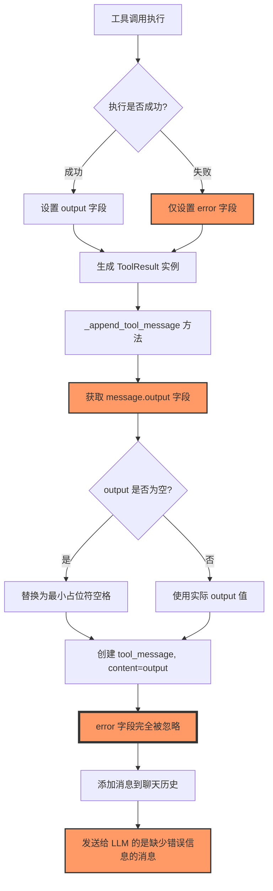

# ToolResult error 字段未被使用的原因分析

## 问题现象

当前系统中，ToolResult 的 error 字段未被正确使用，导致工具调用出错时，发送给 LLM 的是空消息（output 默认为空字符串）。这使得 LLM 无法正确理解工具调用的错误原因，影响后续对话质量。

## 问题原因流程图



## 详细分析

### 1. 错误设置过程

在工具执行器（`app/tools/core/tool_executor.py`）中，当工具执行出错时，创建 ToolResult 实例只设置了 error 字段，没有设置 output 字段：

```python
# 返回错误结果
result = ToolResult(
    error=error_msg,  # 只设置了 error，没有设置 output
    name=tool_name
)
```

由于 ToolResult 类中 output 字段的默认值是空字符串：

```python
output: str = Field(default="", description="工具执行的结果，将作为输出返回给大模型")
```

这导致工具执行失败时，ToolResult 实例的 output 字段是空字符串。

### 2. 错误传递过程

在 `_append_tool_message` 方法中（`app/magic/agent.py`），构造发送给 LLM 的消息时，仅使用了 output 字段：

```python
# 确保工具输出内容不为空
output = message.output
if output is None or (isinstance(output, str) and output.strip() == ""):
    output = " "  # 至少有一个空格
    logger.warning(f"空的工具输出对应的 message: {message}")
    logger.warning(f"检测到空的工具输出内容，已替换为最小占位符。工具名: {message.name}, ID: {message.tool_call_id}")

tool_message = {
    "role": "tool",
    "content": output,
    "tool_call_id": message.tool_call_id,
    "is_internal": is_internal,
}
```

完全忽略了 error 字段，导致错误信息无法传递给 LLM。

### 3. 已有功能未使用

ToolResult 类已经实现了 `__str__` 方法来优先显示错误信息：

```python
def __str__(self):
    return f"Error: {self.error}" if self.error else self.output
```

但在 `_append_tool_message` 方法中没有利用这个方法，而是直接使用了 `message.output`。

## 结果影响

1. 当工具执行出错时，LLM 收到的是空消息或者最小占位符（一个空格），而不是实际的错误信息
2. LLM 无法理解工具调用的错误原因，导致后续对话质量下降
3. 用户看不到实际的错误信息，无法有效排查问题

## 问题修复焦点

问题的关键修复点在于 `_append_tool_message` 方法中，需要优先使用 error 字段，或者利用已有的 `__str__` 方法。
